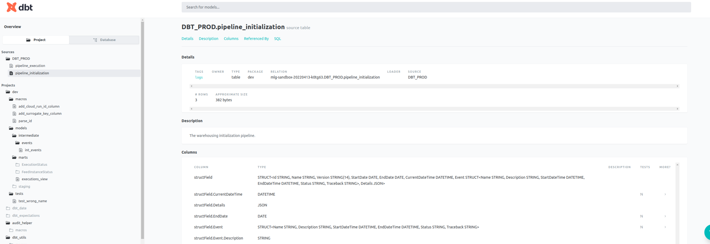

# BP-Test-Dbt
This is an example repository created directly from a **dbt** template.
This repository is a comprehensive example of DBT project created to manage **SQL** code.

## Local environment
Create **.env** file:

| **Variable**         | **Description** | **Value**   |
|----------------------|-----------------|-------------|
| _PROJECT             | Project name    | BP-Test-Dbt |
| _USER                | User name       | Filip-231   |

Make a GCP project with BigQuery API enabled.  Create a dataset `DBT_PROD` and build sources.
To do that run `.sql` code from sources folder.
The material tables will appear and the dbt views will have sources.
After that run scripts to insert the data.

Check your account ID in IAM. Navigate to IAM tab, choose project and copy the account id.
Create **credentials_json** using your terminal with copied IAM account ID:
```
gcloud iam service-accounts keys create credentials_json \
    --iam-account=filip-123@sandbox-20220312-abcd.iam.gserviceaccount.com
```

In the main folder create **credentials_json** file and pass there you credentials.

## Repository secrets:

Copy this to you secret `DBT_PROFILES`:
```
config:
  send_anonymos_usage_stats: false
  use_colors: true

dev:
  target: dev
  outputs:
    dev:
      type: bigquery
      method: oauth
      project: mlg-sandbox-20220413-k0tg63
      dataset: DBT_DEV
      threads: 4
      location: EU
    prod:
      type: bigquery
      method: oauth
      project: mlg-sandbox-20220413-k0tg63
      dataset: DBT_PROD
      threads: 4
      location: EU
```

It should point to your GCP project with created tables and views in **specified region: EU.**

Create a secret: `CREDENTIALS_JSON` in environment secrets and pass the **credentials.json**.
Now the GitHub Actions have access to your GCP account and can do the workflow.
## Features
After installing local environment `. .venv/bin/activate` and `make help` to see help message.

```
all                 commit and push all changes
brew-allure         install allure with brew long
build               create a build artifact locally
bump                (PART= ) bump the release version - deduced automatically from commit messages unless PART is provided
changelog           (UNRELEASED= the name of the current version) update the changelog incrementally.
check-commit        check the commit message is valid
clean               clean up temp and local build files
commit              make interactive conventional commit
deploy-dbt          (DBT_TARGET=dev DIFF= ) deploys dbt
docker-download-package (VERSION= ) download package from GH package registry
docker-exec         exec in a docker container
docker-run-package  (VERSION= ) run package downloaded from GH package registry
docs                (BROWSE= ) build code documentation
down-volumes        remove docker images and volumes
format              run code formatting tools
get-version         output the current version
git                 reset git, specify new project and git user
help                display this help message
init                (LANGUAGE=django/tool/dbt) create cruft project and install pre-requirements
install             install the requirements
lint                (DIFF= ) run code linting tools
pre-install         install pre-requirements
release             create a new github release
set-project-name    (_PROJECT=project _USER=user ) set initial environment
tag                 pull tags and tag a new version
test                (DIFF= ) run unit tests
update-makefiles    update configuration files
update-project      update cruft project and install pre-requirements # $(_DIR_STRUCTURE)
update              update cruft project and configuration files
venv                install virtual environment

```
***
## Continuous Integration and delivery
Complete CI-CD process will be visible in GitHub Actions [page](https://github.com/Filip-231/BP-Test-Dbt/actions) containing:
* **CI** - run on every push to master and on pull requests
  * Test  - run unit tests
  * Format - checks if code is formatted
  * Lint - run static code check with sqlfluff
  * Docker - build and up docker image which invoke **dbt build**
* **CD** - manually triggered automatic deploys to Oracle cloud environments and GH releases
  * Deploy Testing - deploy to testing environment - a DBT_DEV dataset on BigQuery
  * Bump Version - bump current version and push a tag to a repository - after review and approve
  * Publish Release - publish new release to GitHub [releases](https://github.com/Filip-231/BP-Test-Dbt/releases)
  * Publish Package - build docker package and push to GitHub [packages](https://github.com/Filip-231?tab=packages&repo_name=BP-Test-Dbt)
  * Deploy Production - deploy to production - a DBT_PROD dataset - after review and approve
* **CI/CD** - triggered manually, includes CI and CD pipelines connected


### Unified interactive commits with pre-hook
Pre-hook checks depends on what scope has been changed.

<center>


</center>

### DBT docs
After running `make docs BROWSE=True` :



## Airflow
First run `dbt docs generate`. The **target/manifest.json** file will be created.

To create DAG you can use python script.
```
python generate_dbt_dag.py -schedule "*/5 * * * *"
```
Will create a dag file schedule every 5 minutes. Copy this file to you airflow project folder with dags.
The model graph will look like this:


